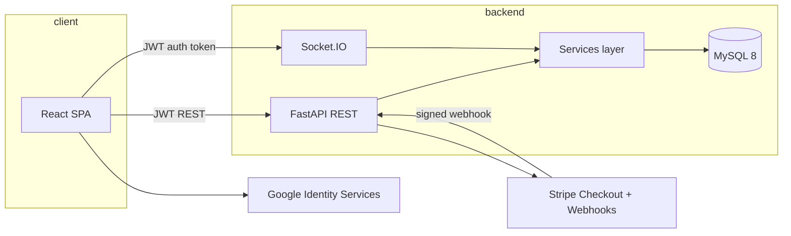

# Architecture

## System overview



## Booking lifecycle

```text
REQUESTED
    │ owner approves
    ▼
PAYMENT_PENDING
    │ buyer pays via Stripe Checkout
    ▼
Stripe webhook (verified, idempotent)
    ▼
CONFIRMED
```

Terminal states: `REJECTED`, `CANCELLED`, `EXPIRED`.

## Security boundaries

| Concern | Enforcement |
|---------|-------------|
| Authentication | JWT on REST; same token on Socket.IO connect |
| Identity | Server derives `user_id` from JWT — never trusts client IDs |
| Deposits | Calculated server-side from listing price |
| Payments | Checkout only in `payment_pending`; amounts from stored booking |
| Webhooks | Stripe signature verification + unique `event_id` claim-first |
| Slot conflicts | Row lock + unique `slot_key` constraint |
| Property delete | Soft archive; bookings/payments preserved |

## Canonical entry points

- **Application:** `backend/app/main.py`
- **Compatibility shim:** `backend/server.py` (re-export only)
- **Schema migrations:** `alembic upgrade head` (required in production/staging)
